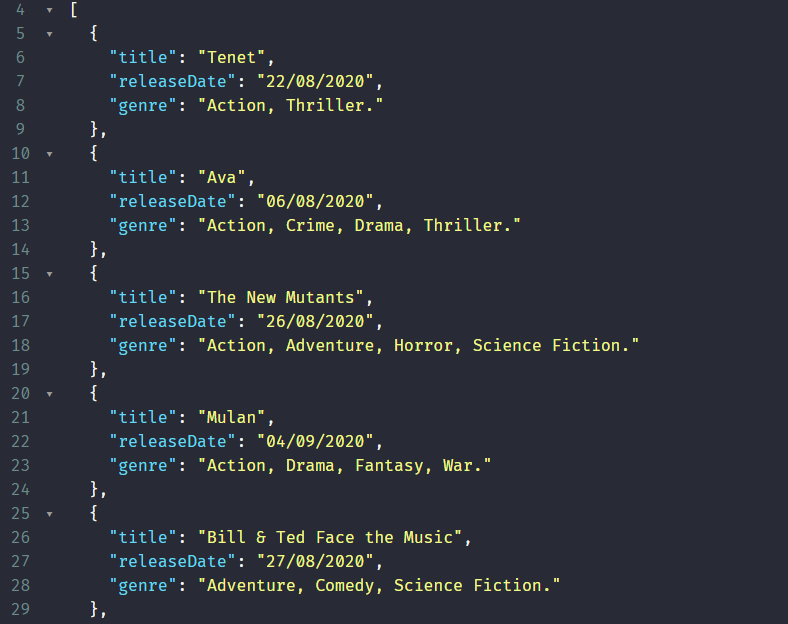

<h2 aligin="center">Movie API</h2>

### :rocket: Tecnologias usadas

Este projeto foi desenvolvido com as seguintes tecnologias:

<table>
  <thead>
    <th>.NET Plataform</th>
  </thead>
  <tbody>
    <tr>
      <td>C#</td>
      <td>:white_check_mark:</td>
    </tr>
    <tr>
      <td>.NET Core 3.0</td>
      <td>:white_check_mark:</td>
    </tr>
    <tr>
      <td>Refit</td>
      <td>:white_check_mark:</td>
    </tr>
    <tr>
      <td>Microsoft.Extensions</td>
      <td>:white_check_mark:</td>
    </tr>
  </tbody>
  
</table>

### :package: Sobre o projeto

O proje visa a construção de uma API que busca simplificar os dados que são oriundos da API de Banco de Dados de Filmes (https://www.themoviedb.org/), tratando e exibindo de forma que a aplicação que venha a consumí-la trate apenas da exibição no frontend.

 

 

### :building_construction: Os padrões utilizados

Injeção de dependência, utlizado na controller para estabelecer a service que trata retorno da listagem de filmes que estão para serem lançados (upcomming).

Acredito que devido a objetividade do projeto não considerei a adoção de algo que envolvesse mais padrões, tomei essa decisão por considerar que o objetivo alcançado é o ideal e que estou aberto para aprender sempre, é possível que tenha feito uso de outros padrões, mas que pelo uso recorrente de forma natural não me venha a identificá-lo como algo a ser listado.

### :speech_balloon: Bibliotecas Externas

Refit - O pacote é amplamente conhecido por implementar a criação de consultas no padrão REST dentro de projetos .NET Core, Xamarin ou .NET Framework. O seu uso se tornou tão amplo que foi integrado aos artefatos da Microsoft e é hoje um dos pacotes oficiais mais utilizados, com mais de 7.5 milhões de downloads pelo Nuget.

Eu particularmente escolhi utilizá-lo por facilitar em muito a recuperação de dados da API Data Base, porque entendo que o desafio é toda a tratativa do dado e a articulação que se deve fazer para transportar o dado e exibí-lo de forma correta para o objetivo do desafio.

Microsoft.Extensions - O pacote possibilita a utilização em memória um provedor de configuração que se baseia em chave-valor.

Eu utilizei o pacote .Configuration e o .Json para ter acesso de outro assembly na mesma solution ao aquivo appsetting.json, com o objetivo de estabelecer no arquivo json todos os parâmetros referêntes ao acesso a API Data Base, uma vez que pensando em manutenabilidade, já se pode mostrar um caminho para desacoplar um dos elementos que podem variar e assim evitar o "hard coded" de informações que também são sigilosas como a API Key, proveniente do cadastro realizado juntamente a Movie Data Base API.

## :twisted_rightwards_arrows: Branches

Master - Fiz uso do template comum a criação de API utilizando o Visual Studio 2019, ajustei a versão do .NET Core que por padrão já está definida como 3.1 para 3.0, justamente para atender ao critério do desafio.
Obviamente existem arquivos no versionamento nessa branch, mas considerei apenas como um bootstrap para o desafio. Também foram criados os arquivos ocultos do git .gitattributes e .gitignore, espero que não seja algo danoso, haja vista que nada foi desenvolvido por mim nessa branch, me atendo aos requisitos do desafio, porém do o bootstrap que detalhei anteriormente.

Dev - Todo o desenvolvimento foi feito, com o maximo de cuidado e respeito pela oportunidade que estão me dando, busquei atribuir títulos significativos aos commits e que visassem esclarecer a quem estiver lendo, não foram muitos, tendo em vista que a carga de atividades realizadas entre eles foi grande porque se tornava necessário para entregar uma parte funcional da aplicação.
